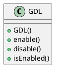

# Giraffe Data Link (GDL)

## Introduction

## Interface Class

### Class Members
- `GDL()`: Constructor

- `enable()`: Enable GDL
- `disable()`: Disable GDL
- `isEnabled()`: Check if GDL is enabled

