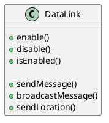

# Giraffe Data Link (GDL)

### Class Members
- `GDL()`: Constructor

- `enable()`: Enable GDL
- `disable()`: Disable GDL
- `isEnabled()`: Check if GDL is enabled

```plantuml
@startuml
class DataLink {
    + enable()
    + disable()
    + isEnabled()

    + sendMessage()
    + broadcastMessage()
    + sendLocation()

}
@enduml
```

